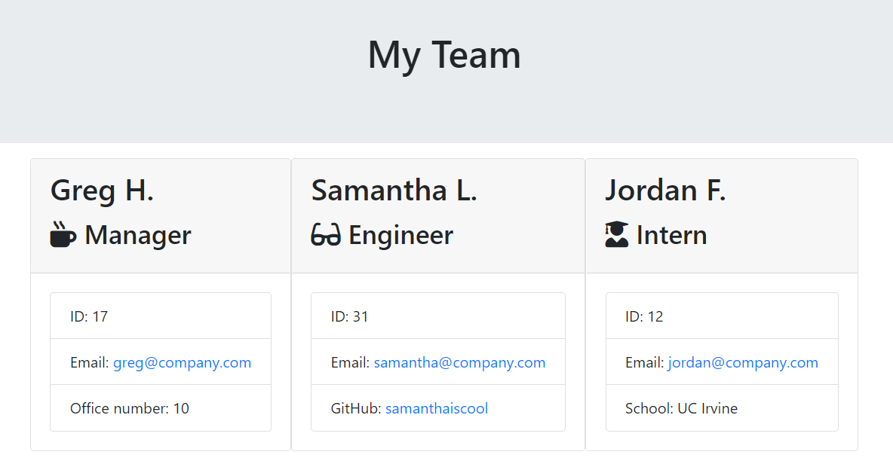

# Team Profile Generator

This application allows users to generate a web page filled with all of their team memebers at their company. The select roles are Engineer, Manager, and Intern. The output page will display an individual card for each employee with their name, email, employee ID, and one other piece of information specific to their role. 

## Table of Contents

- [Title](#Title)
- [Description](#Description)
- [Installation](#Installation)
- [Usage](#Usage)
- [Tests](#Tests)
- [Photos & Demo](#Photos)

## Installation 

Begin by downloading NodeJS, then prior to running the application ensure to input into the terminal "npm install". This will download all the relevant node packages. If you are running into any issues, try running "npm install inquirer" as this package might be separate and require installation.

## Usage

Use this application to generate web page filled with relevant info about your team of managers, engineers, and interns. Simply log into the terminal "node app.js" and the application will begin to prompt the user to build their engineering team. Once the user is finished inputting their team members, simply input "N" when asked if another employee shall be added. Once the user inputs "N", the code will write the necessary code to an html file that will be exported to the "output" folder. 

## Tests

The tests run on this application include the files in the test folder: Employee.test, Engineer.test, Intern.test, and Manager.test.

## Photos & Demo

